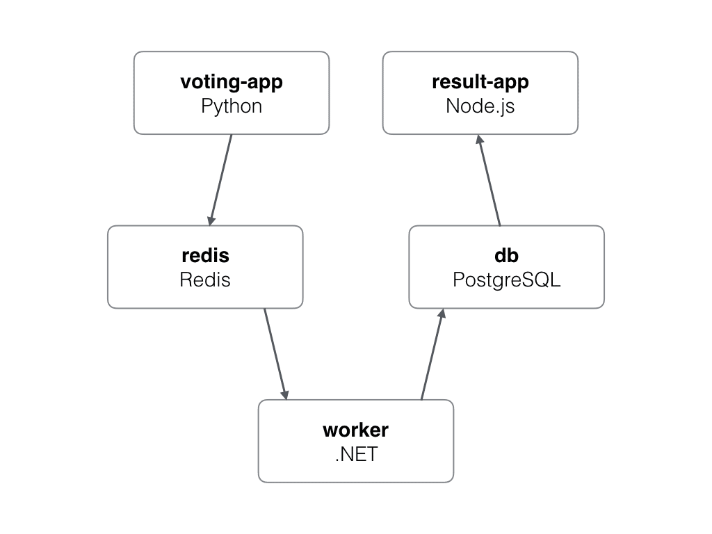

# Example Voting App

## Architecture



* A front-end web app in [Python](/vote) which lets you vote between two options
* A [Redis](https://hub.docker.com/_/redis/) which collects new votes
* A [.NET](/worker/) worker which consumes votes and stores them in…
* A [Postgres](https://hub.docker.com/_/postgres/) database backed by a Docker volume
* A [Node.js](/result) web app which shows the results of the voting in real time

## Build new tag release

The commits for image creation need to adhere to the following specifications for the generation of new releases:


**Major:**  
- This indicates a new feature (`feat`) with a scope of "software" and the message mentions the major implementation.
  - `feat(major-"serviceName"): Message commit`


**Minor:**
- Another new feature (`feat`) within the "software" scope, this time focusing on adding new features and optimizations.
  - `feat(minor-"serviceName"): Message commit`


**Patch:**
- This represents a fix (`fix`) in the "bugs" scope, specifically addressing critical issues for maintaining software stability.
  - `fix(patch-"serviceName"): Message commit`

### Examples
Using the service name `result` below are examples of each type:

**Major:**  
```shell
git commit -m "feat(major-result) implement responsive design and integrate new UI components"
```
If the previous version had the following tag `v1.2.3-result`, the new major version will overwrite the minors and patches and create the new version `v2.0.0-result`.

**Minor:**
```shell
git commit -m "feat(minor-result) add unit tests for user authentication module"
```
If the previous version had the following tag `v1.2.3-result`, the new minor version will overwrite the patches and create the new version `v1.3.0-result`.

**Patch:**
```shell
git commit -m "fix(patch-result) implement responsive design and integrate new UI components"
```
If the previous version had the following tag `v1.2.3-result`, the new patch version will be `v1.2.4-result`.